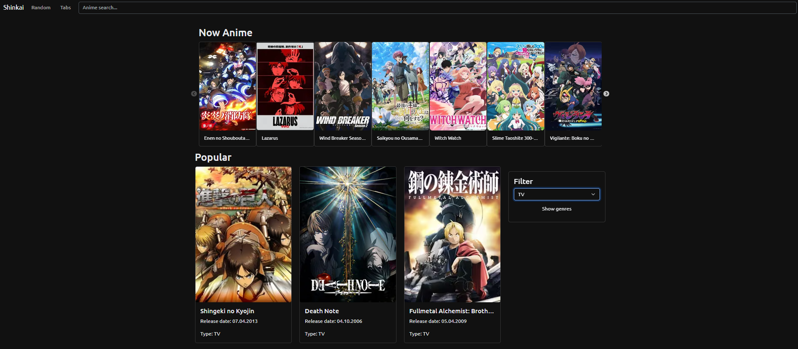

# Shinkai - Аниме Портал

**Shinkai** — это веб-приложение для поиска аниме, просмотра детальной информации и управления персональными списками (Planned, Watching, Completed, Dropped). Проект реализован на основе современных веб-технологий и предоставляет удобный интерфейс для взаимодействия с пользователем.

---

## Описание

Shinkai позволяет пользователям:
- Искать аниме по названию.
- Получать случайные рекомендации аниме.
- Отслеживать текущие сезоны трансляций.
- Добавлять аниме в персональные списки (Planned, Watching, Completed, Dropped).
- Фильтровать результаты по жанрам и типам (TV, Movie, OVA и т.д.).
- Переключаться между светлой и тёмной темами.

---

## Технологический стек

Проект реализован с использованием следующих технологий:

- **Frontend:**
  - **React.js**: Библиотека JavaScript для создания пользовательского интерфейса.
  - **TypeScript**: Статическая типизация для обеспечения надёжности кода.
  - **React Router DOM**: Для маршрутизации внутри приложения.
  - **Bootstrap**: CSS-фреймворк для быстрой верстки и использования готовых компонентов.
  - **Slick Carousel**: Библиотека для создания слайдеров.
  - **React Bootstrap**: Компоненты Bootstrap, адаптированные для React.
  - **react-intersection-observer**: Для ленивой загрузки изображений.

- **API:**
  - **Jikan API**: RESTful API для получения данных об аниме.

- **Другие инструменты:**
  - **localStorage**: Для сохранения данных пользователя (списки аниме и темы).
  - **CSS3**: Для стилизации компонентов.

---

## Живая демо-версия

Посмотреть живую версию приложения можно [здесь](https://sanferq.github.io/Shinkai-Anime/).

---

## Скриншоты

### Основной интерфейс




## Структура проекта

```
src/  
├── img/  
│   └── ├── arrow-back.svg  
│       ├── arrow-forward.svg  
│       ├── dark-mode.svg  
│       ├── menu.svg  
│       └── sunny-mode.svg                   # Изображения и иконки  
│      
├── components/  
│   ├── components-css/        # Стили для компонентов  
│   │   ├── animeCard.css  
│   │   ├── filter.css  
│   │   ├── navbar.css  
│   │   ├── nowAiring.css  
│   │   └── theme.css  
│   ├── AnimeCard.tsx          # Компонент карточки аниме  
│   ├── Filter.tsx             # Компонент фильтрации аниме  
│   ├── Navbar.tsx             # Навигационная панель  
│   ├── NowAiring.tsx          # Компонент показа текущего сезона  
│   └── ThemeToggle.tsx        # Переключатель темы  
├── context/                   # Контекст для управления состоянием  
├── pages/  
│   ├── pages-css.css          # Стили для страниц  
│   ├── AnimeDetails.tsx       # Страница подробной информации об аниме  
│   ├── Home.tsx               # Главная страница  
│   ├── Planned.tsx            # Страница списка запланированного аниме  
│   ├── RandomAnime.tsx        # Страница случайного аниме  
│   └── Search.tsx             # Страница поиска аниме  
├── utils/  
│   └── localStorage.ts        # Утилиты для работы с localStorage  
├── index.css                  # Глобальные стили  
├── App.tsx                    # Основной компонент приложения  
├── main.tsx                   # Точка входа в приложение  
├── index.html                 # Главный HTML-файл  
├── README.md                  # Документация проекта  

```

---

## Функциональность

### Основные возможности:
- **Поиск аниме**: Вводите название аниме, и система покажет соответствующие результаты.
- **Случайное аниме**: Нажмите кнопку "Random", чтобы получить случайное аниме для просмотра.
- **Текущие сезоны**: Список аниме, которые транслируются прямо сейчас.
- **Персональные списки**: Добавляйте аниме в категории "Planned", "Watching", "Completed" или "Dropped".
- **Фильтры**: Фильтруйте аниме по жанрам и типу (TV, Movie, OVA и т.д.).
- **Тёмная тема**: Переключайтесь между светлой и тёмной темой через кнопку в нижнем правом углу.
- **Мобильная оптимизация**: Сайт поддерживает адаптивный дизайн

---

## Будущие улучшения

- **Авторизация**: Добавить возможность регистрации и авторизации пользователей.
- **Рейтинги и комментарии**: Разрешить пользователям оценивать аниме и оставлять комментарии.
- **Уведомления**: Оповещать пользователей о выходе новых серий их любимых аниме.
- **Оптимизация производительности**: Реализовать кэширование запросов и ленизацию загрузки данных.

---

## Контакты

Если у вас есть вопросы или предложения, вы можете связаться со мной:

- **Email**: [proselkinmaksim@gmail.com](mailto:proselkinmaksim@gmail.com)
- **LinkedIn**: [Maksim Proselkin](https://www.linkedin.com/in/maksim-proselkin-769790363/)
- **GitHub**: [@sanferq](https://github.com/sanferq)

---

